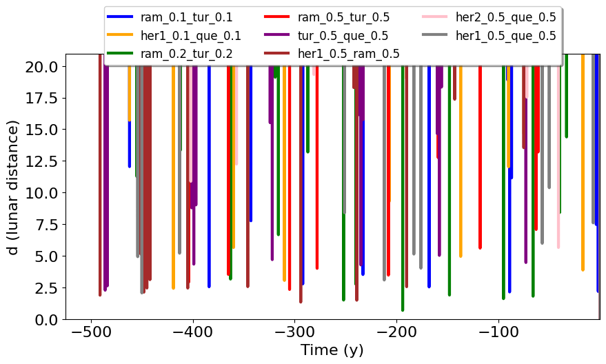
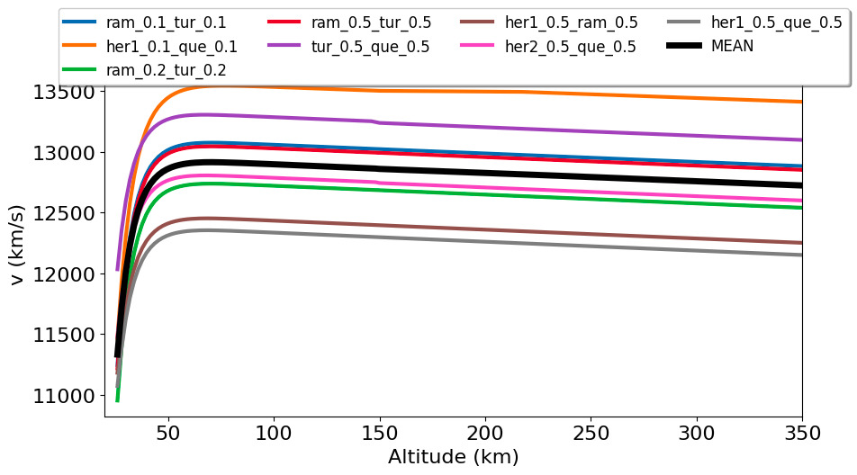
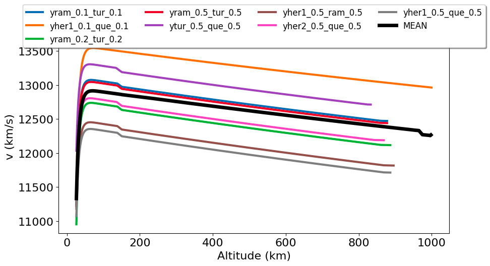
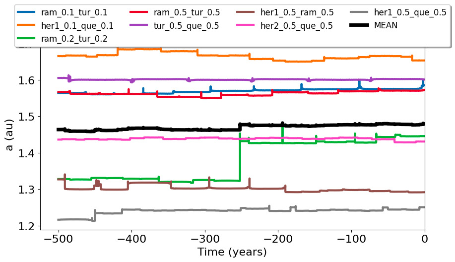
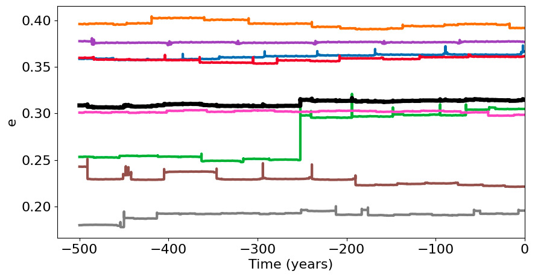
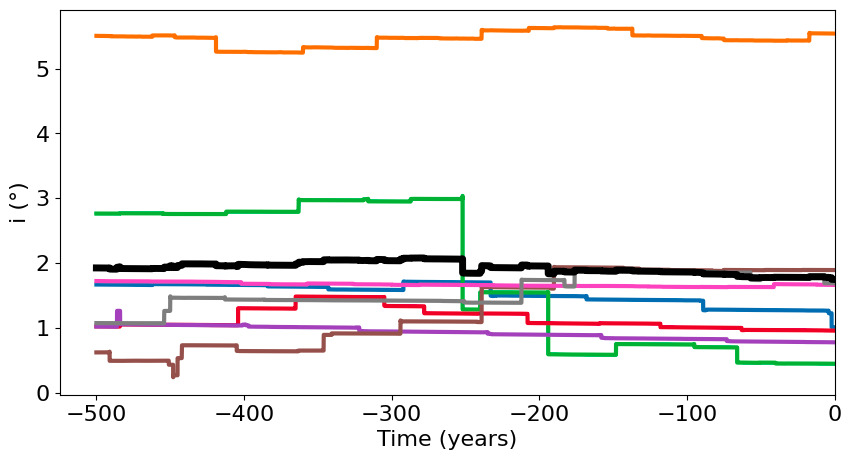
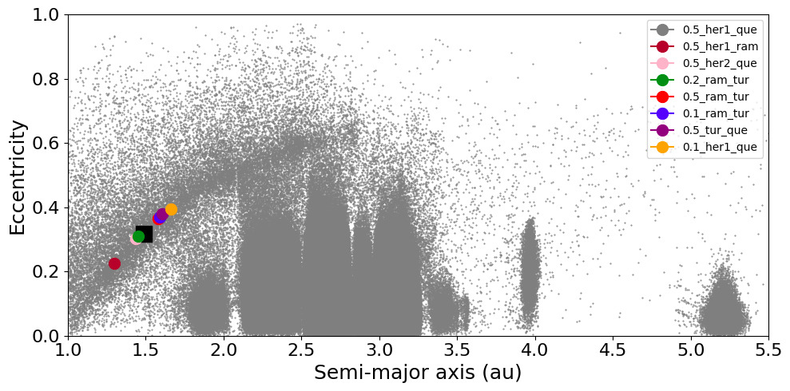
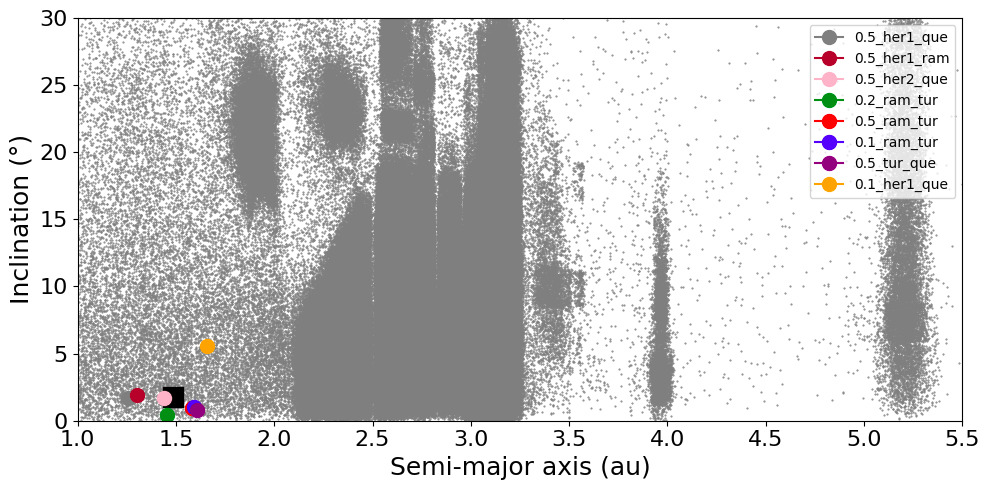
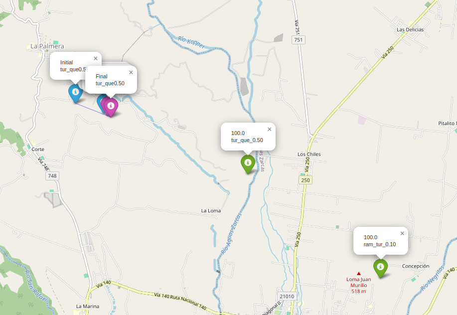

<h1 align="center"> PIM - Programa Integrador de Meteoros </h1>

<p align="center">
  
</p>


# Index

* [Project Description](#project-description)
* [Technologies Used](#technologies-used)
* [Features](#features)
* [Project Access](#project-access)
* [Code Versioning (Git)](#code-versioning-git)
* [Contributors](#contributors)
* [License](#license)


# Project Description
The "PIM" is a computational program developed with the objective of studying and modeling the behavior of meteoroids as they enter the Earth's atmosphere. It allows the simulation and analysis of entry dynamics, atmospheric trajectory, orbital evolution, and the dispersion of meteorite fragments, contributing both to planetary science and to strategies for meteorite recovery.

# Technologies Used   


# Features 

`Imput and Output`

✔️ Load XML files with meteorological data.

✔️ Perform conversion of astronomical coordinates.

✔️ Visualize wind speeds and directions.

✔️ Match data by location and time.

✔️ Export results to Excel spreadsheets. 

`Wind Cluster`

✔️ Convert celestial and geographic coordinates.

✔️ Simulate particle dispersion between two points.

✔️ Calculate the local radius of the Earth.

✔️ Run orbital dynamics simulations.

✔️ Generate graphical visualizations and interactive maps.

✔️ Cluster wind data.

`Wind Table Generator`

✔️ Connects to the Climate Data Store (Uses the cdsapi library)

✔️ Downloads meteorological data

✔️ Processes the data

✔️ Converts pressure levels to altitude

✔️ Generates a results table

✔️ Exports the results
 


# Results
`Imput and Output`

Wind speed and direction graphs.

Excel spreadsheets with paired data.


  <p align="center">
  
  </p>
  <p align="center">
  
  </p>
  <p align="center">
  
  </p>
    <p align="center">
  
  </p>
    <p align="center">
  
  </p>
    <p align="center">
  
  </p>
    <p align="center">
  
  </p>
    <p align="center">
  
  </p>
  <p align="center">
  
  </p>

`Wind Cluster`

Interactive map showing particle dispersion.

Spatial dynamics simulations.

Wind data clustering graphs.

   

`Wind Table Generator`

Generated file: windTable.csv

Columns in the result table:

    HGHT: estimated altitude in meters

    vx: V wind component in m/s

    vy: U wind component in m/s

    v: total wind speed in m/s

    theta: wind direction in degrees (meteorological)


# Project Access
To run the program, it is necessary to ensure that all libraries in the virtual environment are up to date. If the virtual environment has not been created, simply run the command below.

```bash
python -m venv venv
```
Once the environment has been created, the libraries can be installed using the commands below.
```
source venv/bin/activate  # Activate the virtual environment

pip install -r requirements.txt  # Load the libraries
```
To use `Wind Table Generator` is necessary to Register for a free account at: 
```
https://cds.climate.copernicus.eu/
```

Get your API key and save it in a file named `.cdsapirc`

Example `.cdsapirc` file content:
```
url: https://cds.climate.copernicus.eu/api/v2
key: your-uid:your-api-key
```
# Code Versioning (Git)
For code versioning, the [Git](https://git-scm.com/book/en/v2/Getting-Started-What-is-Git%3F) software was used. Its main functions include:

    Downloading the latest updates from the remote repository

    
    git pull origin main
    
Create a new local version
```
# Include file or directory for new version
git add <nome_do_arquivo/pasta>

# Create a new version with previously included files.
git commit -m "Comentário da nova versão"
```
Upload the local versions to the remote repository.
```
git push origin main
```


# Contributors

| [<br><sub>Natália Carvalhinha</sub>](https://github.com/nataliacarvalhinha) |  [<br><sub>Felipe Okamura</sub>](https://github.com/felipeokamura01) |  
| :---: | :---: | 


# License

This project is licensed under the GNU General Public License v3.0 (GPLv3).

You are free to use, modify, and distribute this software, provided that you preserve this license in any copies or derivative works.

For more details, see the [GPLv3 license](LICENSE.txt). 


